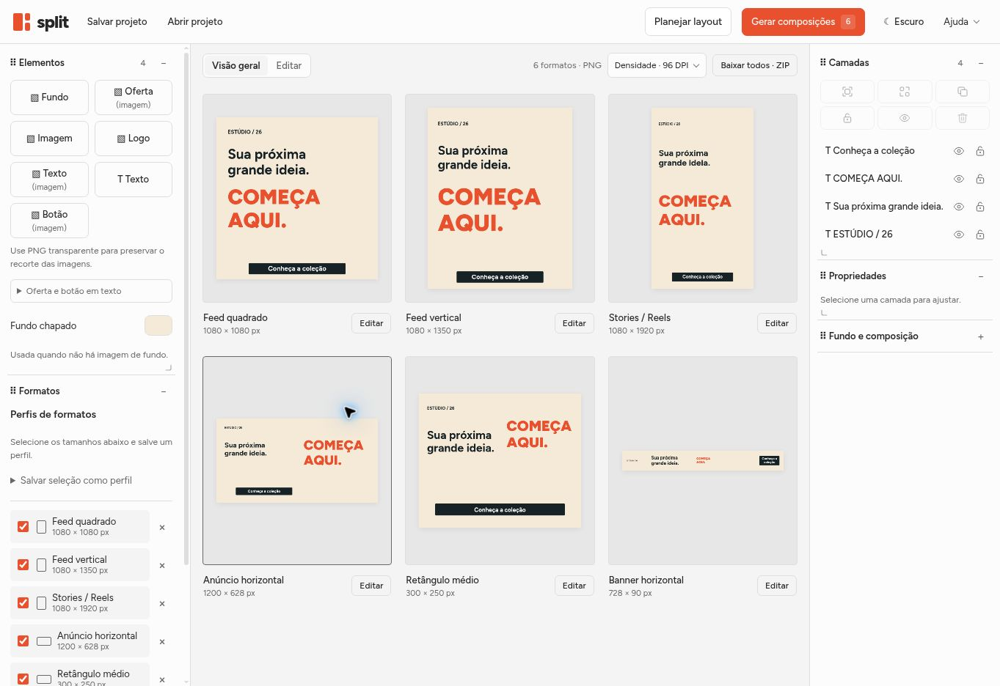

# Split

Editor web para transformar imagens, textos, logos, ofertas e botões em peças publicitárias de vários formatos.




## Executar localmente

O app é estático: não precisa de Node.js, build, backend ou chave de API. Com Python 3 instalado:

```sh
git clone https://github.com/Keve00/split.git
cd split
python -m http.server 8000 --directory dist
```

Abra http://localhost:8000. No Windows, também é possível usar `py -m http.server 8000 --directory dist`.

Use um servidor HTTP em vez de abrir o HTML diretamente, para que fontes e recursos locais sejam carregados corretamente.

## Como usar

1. Adicione um fundo ou escolha uma cor chapada. Carregue as imagens de logo, texto, oferta e botão ou escreva os textos no editor.
2. Selecione formatos de saída; cadastre tamanhos personalizados e salve seleções em perfis.
3. Clique em **Gerar composições** e ajuste os diagramas de posição para peças horizontais, superhorizontais, verticais e superverticais.
4. Edite cada peça: mova, redimensione proporcionalmente, gire, agrupe, alinhe, oculte e bloqueie camadas. Use Ctrl+Z para desfazer.
5. Ajuste o fundo, o foco e seu zoom. Exporte um PNG ou todos os formatos em ZIP.
6. Salve um arquivo `.split` para guardar imagens, formatos, diagramas e ajustes da campanha.

A geração de layouts e as adaptações de fundo acontecem no navegador, com algoritmos locais e OpenCV. Não utilizam LLMs ou modelos de geração de imagens.

## Dados e exportação

- Perfis, preferências e recuperação automática são locais ao navegador. O repositório não armazena campanhas nem imagens enviadas pelos usuários.
- O arquivo `.split` contém os dados e as imagens necessários para reabrir a campanha em outro navegador.
- O PNG mantém exatamente as dimensões escolhidas em pixels. O controle de DPI grava a densidade de impressão e não aumenta a quantidade de pixels.
- Elementos fora da peça são recortados na exportação.

## Atalhos

- Ctrl + rolagem sobre o canvas: zoom da visualização.
- Espaço + arraste: navegar no canvas.
- Shift + clique: selecionar várias camadas.
- Alt + redimensionamento: redimensionar pelo centro.
- Ctrl+Z / Ctrl+Shift+Z: desfazer / refazer.

## Estrutura

Todo o app está em `dist/`:

- `index.html`, `styles.css`, `workspace.css`: interface e temas.
- `app.js`, `editing.js`, `rotation.js`, `alignment.js`: canvas e edição.
- `layout.js`, `blueprint.js`, `adaptation.js`: composição e planejamento.
- `background.js`, `synthesis.js`, `feather.js`: adaptação e suavização do fundo.
- `project-codec.js`, `projects.js`, `format-profiles.js`: projetos e perfis.
- `output-density.js`: densidade DPI dos PNGs.
- `fonts/` e `vendor/`: fontes Figtree e OpenCV, com suas licenças.

## Hospedagem estática

Publique o conteúdo de `dist/` em qualquer hospedagem estática. Não há etapa de compilação.

Para GitHub Pages, use uma configuração de GitHub Actions que publique `dist/` como artefato de Pages. Apenas enviar o código ao repositório não ativa a hospedagem.

## Recursos de terceiros

- Figtree: `dist/fonts/OFL.txt`.
- OpenCV: `dist/vendor/OpenCV-LICENSE.txt`.

Versão inicial deste repositório: código publicado no Split em 8 de outubro de 2026.
