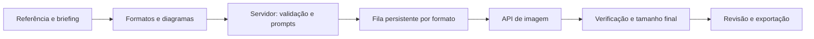

# Split — geração de anúncios a partir de referência

Status: planejamento, sem integração implementada ou chamadas pagas realizadas.
Data: 8 de outubro de 2026.
Branch: `feat/ai-reference-generation`, criada a partir de `main` (`210ca0e`).

## Objetivo

Trocar a montagem obrigatória por imagens separadas por um fluxo em que o usuário envia uma arte de referência, escolhe os formatos e orienta a organização. O modelo recebe a referência e as instruções de cada peça e gera o anúncio completo. A saída principal será uma imagem por formato; os elementos desenhados pelo modelo não serão camadas independentes editáveis.

## Experiência proposta

1. **Referência:** enviar a arte original inteira. Exibir uma prévia e campos opcionais para título, oferta, chamada para ação, cores e orientações de marca.
2. **Entendimento:** analisar a referência uma vez com um modelo que aceite imagens e produza um briefing estruturado. Mostrar textos reconhecidos e dúvidas para correção; nunca inventar preços ou completar texto ilegível silenciosamente.
3. **Formatos:** reutilizar tamanhos e perfis existentes. Mostrar antecipadamente quais dimensões são diretas, ajustadas ou experimentais.
4. **Organização:** sugerir itens de logo, texto, produto, oferta e botão nos quatro diagramas atuais. O usuário pode adicionar, duplicar, remover e definir a quantidade de itens de cada tipo, além de mover e redimensionar suas áreas. Não exigir recortes individuais em PNG.
5. **Geração:** produzir cada formato usando a referência original, o briefing e o diagrama correspondente. Oferecer geração de uma prévia antes do lote, quantidade de variações e estimativa de consumo.
6. **Revisão:** mostrar progresso por peça, comparar com a referência, aprovar, gerar outra versão ou pedir uma alteração em linguagem natural.
7. **Entrega:** exportar PNG/ZIP nas dimensões exatas e salvar um projeto `.split` com referência, briefing, planos, prompts e imagens.

O prompt fica disponível em uma opção avançada; o uso comum acontece pelos campos e diagramas.

## Provedor e autenticação

Recomendação inicial: OpenAI Images API, usando a operação de edição com imagens de referência. Candidato para o piloto: `gpt-image-2.5-sunburst`, recomendado pela documentação para precisão de edição; comparar com `gpt-image-2.5-flare` caso latência seja relevante. A escolha definitiva depende de acesso na conta e de um teste com campanhas reais. [Geração de imagens](https://developers.openai.com/api/docs/guides/image-generation).

Implementar um adaptador de provedor com capacidades declaradas: modelos, entradas, limites de dimensões, qualidade, edição e uso reportado. Evitar espalhar nomes e limites do modelo pela interface. Um segundo provedor só entra após documentar e testar suas capacidades.

| Caminho | Decisão |
| --- | --- |
| Chave de API do projeto | Caminho inicial. Guardada no servidor, via variável de ambiente ou cofre de segredos. |
| Login do usuário no Split | Controla acesso ao app, campanhas e orçamento; é independente da credencial do modelo. |
| OAuth com uso do plano ChatGPT | Adiado para geração: a documentação atual desse fluxo exclui a ferramenta de geração de imagens. |
| Chave própria por usuário | Possível etapa posterior, com armazenamento criptografado no servidor e opção de revogação. |

A documentação distingue identidade de uso do plano e limita o fluxo aberto a cenários elegíveis. Não presumir que uma assinatura autoriza os endpoints de imagens. [Visão geral de OAuth](https://developers.openai.com/siwc/token-sharing-open-source), [limitações atuais](https://developers.openai.com/siwc/token-sharing-open-source/preview-limitations). Chaves nunca devem ir para JavaScript público, Git, logs ou arquivos `.split`. [Autenticação da API](https://developers.openai.com/api/reference/overview).

## Dimensões: separar geração de entrega

Cada peça terá `targetSize` (tamanho solicitado), `generationSize` (aceito pelo modelo) e `finalization` (operação para entregar o arquivo). Informar esse tratamento antes de iniciar o lote.

Os modelos candidatos documentam lados múltiplos de 16, proporção máxima de 3:1, lado máximo de 3840 e entre 655.360 e 8.294.400 pixels; resoluções acima de 2560 × 1440 são experimentais. Validar todos os limites conjuntamente. [Limites de saída](https://developers.openai.com/api/docs/guides/image-generation#size-and-quality-options).

- **Formato compatível:** gerar diretamente na dimensão final.
- **Formato próximo:** gerar com proporção igual ou próxima, reservar margem e finalizar com redimensionamento proporcional e recorte mínimo. Exemplo: Stories em 1152 × 2048 pode ser reduzido proporcionalmente para 1080 × 1920. Não deformar imagens para encaixar.
- **Peça pequena:** gerar em resolução maior com a mesma proporção e reduzir. Avaliar legibilidade na dimensão real.
- **Proporção extrema:** 728 × 90 tem aproximadamente 8,09:1 e não cabe na geração direta do candidato. Fazer um piloto com uma faixa de composição dentro de uma tela aceita pelo modelo, mapear todas as áreas para essa faixa e recortar após a geração. A aderência é experimental; não considerar resolvido apenas porque o PNG final tem o tamanho certo.
- **Limite não atendido:** informar o motivo e oferecer outro tamanho ou modo compatível. Extensão em etapas ou outro provedor são alternativas futuras, sujeitas a avaliação; não prometer suporte visual adequado a todos os formatos personalizados.

Gate da primeira prova de conceito: aprovar quadrado, vertical e o banner extremo. Se o extremo falhar repetidamente, limitar o MVP aos formatos validados ou implementar um caminho específico antes de anunciar cobertura total.

## Como o layout vira instrução

### Itens e quantidades no planejador

Requisito acrescentado: cada composição deve permitir escolher quais itens aparecem e quantos existem. Os cinco tipos atuais deixam de ser cinco áreas obrigatórias.

- Exibir uma lista de itens com nome, tipo e ações de adicionar, duplicar e remover. Exemplos: dois textos, três produtos, um logo e nenhum botão.
- Oferecer quantidade por tipo, incluindo zero. Aumentar a quantidade cria instâncias independentes; diminuir permite escolher quais remover quando houver conteúdo configurado. As duas formas de edição atualizam a mesma lista.
- Cada instância possui identidade estável, nome, conteúdo ou descrição próprios e caixa de posição/tamanho. Duplicar cria outra identidade e mantém os demais itens intactos.
- Aplicar mudanças ao diagrama selecionado; oferecer aplicação explícita a outros diagramas. Um formato pode ter ajustes próprios sem alterar os demais.
- Permitir desfazer/refazer adições, remoções, mudanças de quantidade e posições. Novos itens recebem posição inicial utilizável e podem ser organizados livremente.
- Conteúdo novo é informado por texto/descrição ou vinculado ao briefing da referência, sem exigir um PNG para cada item.
- Remover significa excluir da composição gerada, mesmo que o item exista na referência. Registrar exclusões explícitas; não basta omitir a área do guia, pois o modelo poderia reproduzi-la a partir da arte original.
- O briefing original fica preservado. Cada composição determina a lista final de itens e suas exclusões; não recriar automaticamente itens removidos ao trocar o formato ou reabrir o projeto.

Evoluir o estado de caixas únicas por tipo para listas de instâncias com `{id, type, name, content, box}` e exclusões por composição. Migrar os cinco itens dos projetos antigos para essa representação, conservando as posições. As quantidades são calculadas a partir da lista, evitando dois valores divergentes. Definir um limite operacional explícito após o piloto de qualidade, sem prometer quantidade ilimitada.

Reaproveitar as caixas normalizadas `{x,y,w,h}` de `SplitBlueprint`, agora vinculadas a cada instância. Para cada tamanho:

1. Resolver a família e aplicar eventuais ajustes específicos da peça.
2. Converter as áreas para coordenadas do espaço de geração, incluindo margens e faixa de recorte quando houver.
3. Criar um guia visual simples, com áreas identificadas, gerado pelo próprio app.
4. Compilar um prompt com briefing, lista final de itens e quantidades, exclusões explícitas, textos literais, prioridade visual, áreas, margem segura, características a preservar e alterações permitidas. As escolhas da composição prevalecem sobre os itens presentes na referência.
5. Enviar a arte original como referência de aparência e o guia como referência de composição, identificando claramente as funções de cada entrada.

Exemplo conceitual de prompt:

> Adapte a campanha da referência para a composição solicitada. Preserve produto, identidade visual e cores. Use o segundo arquivo somente como guia de posição; não desenhe caixas ou nomes do diagrama. Coloque o logo na área A, o título na B, o produto na C, a oferta na D e a chamada na E. Reproduza os textos confirmados literalmente, sem acrescentar valores ou benefícios. Mantenha o conteúdo essencial dentro da área útil informada.

Isso orienta o modelo, mas não garante precisão geométrica, texto perfeito ou reprodução exata de marca. Validar os resultados com checagem de texto, inspeção de composição e revisão humana. Para marcas que exigem fidelidade absoluta, oferecer futuramente uma finalização opcional com texto/logo determinísticos; ela não será requisito do fluxo inicial por referência.

Todas as variações usam o briefing e a referência originais. Uma edição pode acrescentar a versão aprovada, evitando encadear versões como única referência e acumular alterações de identidade.

## Arquitetura proposta

O app atual é estático. Adicionar um servidor Node.js/TypeScript, uma fila persistente e armazenamento de imagens. Para o piloto local, SQLite e arquivos locais são suficientes; uma instalação compartilhada precisa de autenticação, isolamento de campanhas e armazenamento persistente adequado à hospedagem. A escolha do host será feita antes do deploy dessa arquitetura.

Rotas propostas: upload da referência, análise do briefing, estimativa do lote, criação de lote, consulta de progresso, nova versão de uma peça e cancelamento. O servidor valida entradas e recalcula prompts/dimensões, sem confiar apenas na validação do navegador.

Dados principais:

- `Campaign`: referência, briefing confirmado, diagramas e formatos.
- `GenerationBatch`: configuração, limite de gasto e versão do prompt.
- `GenerationJob`: formato, dimensões, estado, provedor, modelo, tentativa e identificador da requisição.
- `GenerationResult`: imagem original, arquivo final, versão, verificações, uso reportado e custo estimado.

Estados por peça: aguardando, gerando, finalizando, pronta, requer revisão, falhou e cancelada. Salvar cada resultado antes de marcar conclusão. Retomar após recarregar a página e exportar as peças prontas mesmo com falhas parciais.

Limitar concorrência e tentativas. Evitar submissões duplicadas; uma desconexão após o envio pode deixar o resultado incerto e não deve disparar outra geração paga automaticamente. Cancelar impede novos trabalhos, mas pode não interromper uma chamada já aceita pelo provedor.

## Mudanças no código existente

| Arquivo/módulo | Modificação planejada |
| --- | --- |
| `dist/index.html`, estilos | Entrada de referência, briefing, configurações, progresso e galeria de versões. |
| `dist/blueprint.js` | Converter áreas fixas em listas de itens; adicionar quantidade, duplicação, remoção e exclusões por composição; extrair compilação independente de dados e guia visual. |
| `dist/app.js` | Substituir a geração síncrona de camadas por lotes e resultados assíncronos no novo fluxo. |
| `dist/format-profiles.js` | Reutilizar seleção; acrescentar compatibilidade de cada formato. |
| `dist/projects.js`, `dist/project-codec.js` | Evoluir schema v4 para v5, migrar projetos antigos e salvar metadados de geração sem credenciais. |
| Exportação e `dist/output-density.js` | Reutilizar PNG/ZIP e DPI; validar dimensões reais do arquivo final. |
| Editor de camadas | Para imagens geradas, disponibilizar prévia, corte e pedido de alteração; não apresentar partes da imagem como camadas editáveis. |
| Novos módulos | Cliente de geração, compilador de prompt, resolução de dimensões, servidor, adaptador e fila. |

Separar regras puras de layout/estado dos acessos globais ao DOM antes de conectar a API. Não é necessário reescrever toda a interface em outro framework.

## Sequência de implementação e aceite

1. **Prova de qualidade:** referência real, textos confirmados e três formatos representativos. Comparar fidelidade, texto, layout, tempo e custo. Define o modelo e o tratamento de proporções extremas.
2. **Uma peça completa:** referência → briefing → diagrama → API → prévia → PNG exato. Credencial exclusivamente no servidor e uso restrito ao dono no piloto.
3. **Lotes confiáveis:** progresso por formato, persistência, falhas parciais, limites de gasto, cancelamento e nova tentativa explícita.
4. **Revisão e projetos:** versões, alteração por texto, migração v4→v5, reabertura de `.split` e ZIP.
5. **Preparação de publicação:** autenticação, armazenamento, limites por usuário, observabilidade e configuração do ambiente.

Testes relevantes: transformação de coordenadas e áreas de recorte; múltiplos itens do mesmo tipo; quantidade zero; exclusão de item presente na referência; desfazer/refazer; isolamento entre diagramas e formatos; persistência de itens e exclusões; limites simultâneos do modelo; dimensões do PNG; migração de projetos; fila após reinício; submissão duplicada; quota esgotada; referência inválida; falha parcial; isolamento entre usuários. Usar provedor simulado nos testes automáticos e uma bateria pequena de gerações reais para qualidade visual.

Critérios de aceite: exportação exata, texto comercial revisável e correto na versão aprovada, conteúdo essencial dentro da área útil, referência recuperável no projeto, nenhuma duplicação involuntária de chamadas e nenhuma credencial exposta.

## Decisões para iniciar a implementação

- Proposta padrão: piloto local/privado, com chave da API configurada no servidor e geração completa da peça.
- Necessário para o piloto: uma campanha de referência, textos que precisam ser literais, acesso ao modelo e teto de consumo do teste.
- Definir hospedagem e cobrança por usuário antes de tornar a geração acessível publicamente.
- OAuth permanece uma possibilidade de autenticação/integração futura conforme as capacidades documentadas; não é dependência do primeiro fluxo de imagens.

Esta branch contém somente o plano. A implementação e a avaliação paga serão etapas seguintes.
